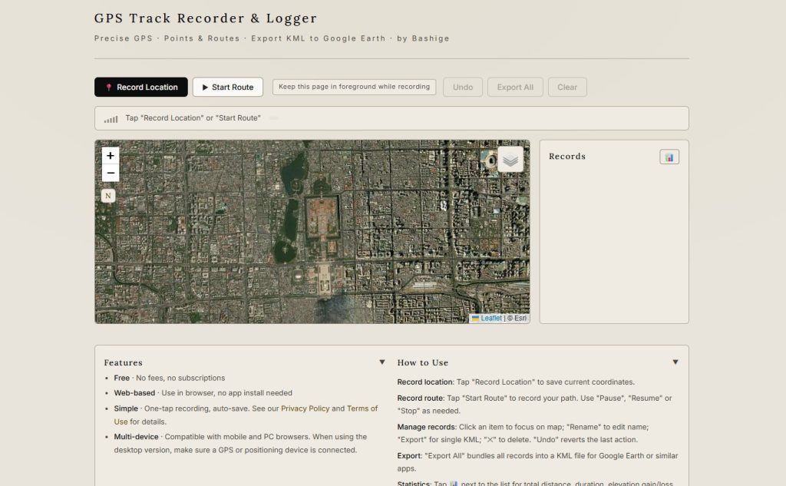

# This is arguably the best free online GPS track logger for outdoor activities out there

As an outdoor enthusiast who enjoys hiking and driving, I like to keep a record of my routes and favorite locations using Google Earth KML files. It’s a great way to retrace my steps whenever I want to revisit those spots.

I used to own a handheld GPS tracker, but I ended up selling it as secondhand after a while. Honestly, smartphone positioning is incredibly accurate these days. While dedicated handhelds offer better ergonomics, waterproofing, and superior satellite reception, my needs are actually pretty simple: I just want to export coordinates or tracks as KML files. I don't need a ton of professional features, and I’m not looking to drop money on expensive hardware again.

I recently developed a **GPS track logger** that runs right in your browser—no matter if you're on a phone or a computer. You don't have to bother downloading an app from Google Play for something you only use once in a while. Just open your browser and go to: <https://gps.bashige.com/>.

This GPS tracker functions by utilizing the device's location services. It can save individual waypoints or record entire tracks, both of which can be exported as KML files for viewing on Google Earth. The app features two built-in street maps, one satellite map, and one elevation map. While they may not match the premium quality of Google Maps, they are more than sufficient for recording waypoints and routes during outdoor activities.

It’s completely free and there are currently no plans to monetize it, so feel free to use it however you like! If you run into any bugs, please let me know—I’ll do my best to fix them promptly.

Unlike native mobile apps, this tool runs exclusively within the browser and cannot access extensive system permissions. Therefore, you must keep the browser running in the foreground; do not switch it to the background or allow your phone to lock its screen. When using the tool on a desktop browser, ensure your computer is connected to the internet and an external GPS device is attached.
